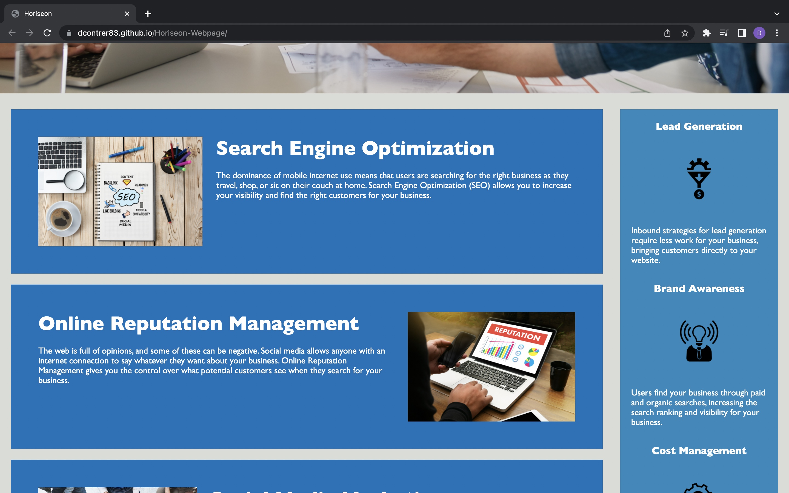

# Module-1-Challenge-Horiseon-Webpage

<h2>Description</h2>
  

This website has a codebase that follows accessibility standars so that the website is optimized for search engines. HTML file and CSS file are edited so that they follow a logical structure and are easier to read.

  
<h2>Screenshots<h2>

  <h2>Link</h2>

  <a href="https://dcontrer83.github.io/Module-1-Challenge-Horiseon-Webpage">Module 1 Challenge Horiseon Webpage</a>
